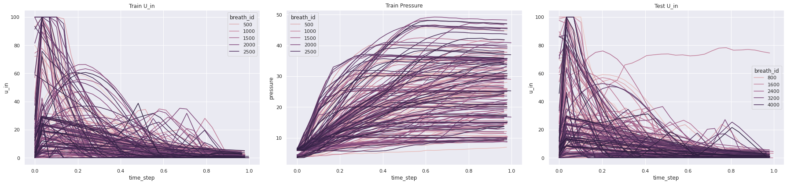

# Ventilator Pressure Prediction


## Objective


The objective of the competition was to develop a deep learning model in order to predict the pressure of ventilators given some parameters and a control variable. The [competition](https://www.kaggle.com/c/ventilator-pressure-prediction/overview/description) was organized by Princeton University and & Google Brain at the Kaggle platform.
<p align="center">
    
    Fig. Samples of u_in (input variable) & pressure for train and test data
</p>


## Description of the solution


+ Models: Bi-LSTM (4 stacked layers)
+ Scheduler: cosine annealing scheduler with warm restarts

The final submission consists of an ensemble of 2 models as described aboved at different checkpoints. These 
checkpoints were obtained before the restart of the scheduler every 50 epochs.


## Running


### 1.Training

<!-- #region -->

```sh
python train_lstm.py --folds 0 1 2 3 4 5 6 7 8 9 10 --name model1 --dropout 0.0
python train_lstm.py --folds 0 1 2 3 4 5 6 7 8 9 10 --name model1 --dropout 0.15
```
<!-- #endregion -->

<!-- #region -->
### 2.Predict
Generate OOF predictions and test predictions for the 2 training models at different checkpoints
```sh
python predict.py --folds 0 1 2 3 4 5 6 7 8 9 10 --name model1 
                  --dropout 0.0 --checkpoints None 400 450 500 550 600
python predict.py --folds 0 1 2 3 4 5 6 7 8 9 10 --name model2 
                  --dropout 0.15 --checkpoints None 400 450 500 550 600
```
<!-- #endregion -->

### 3. Generate Submission


For running the ensemble, change the parameter MODEL_NAMES and run ensemble.py


<!-- #region -->
```sh
# Ensemble models: 
# {'model1':[None,600,550],'model2':[None,600,550,400]}
python ensemble.py
```
<!-- #endregion -->

# Results

Overall code structure is as follows: 

| Model | Public LB | Private LB|
| ------|-----------|-----------| 
|Model1 best| 0.1346|0.1371|
|Model1 checkpoint - 600| 0.1348|0.1366| 
|Model1 checkpoint - 550|0.1355|0.1373|
|Model2 best |0.1352|0.1376|
|Model1 checkpoint - 600|0.1351|0.1375|
|Model1 checkpoint - 400|0.1378|0.1400|
| ------|-----------|-----------| 
|**Median Ensemble**|**0.1312**|**0.1336**|

